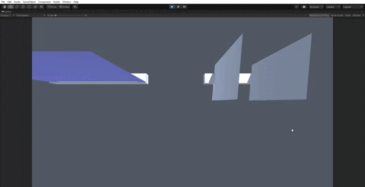
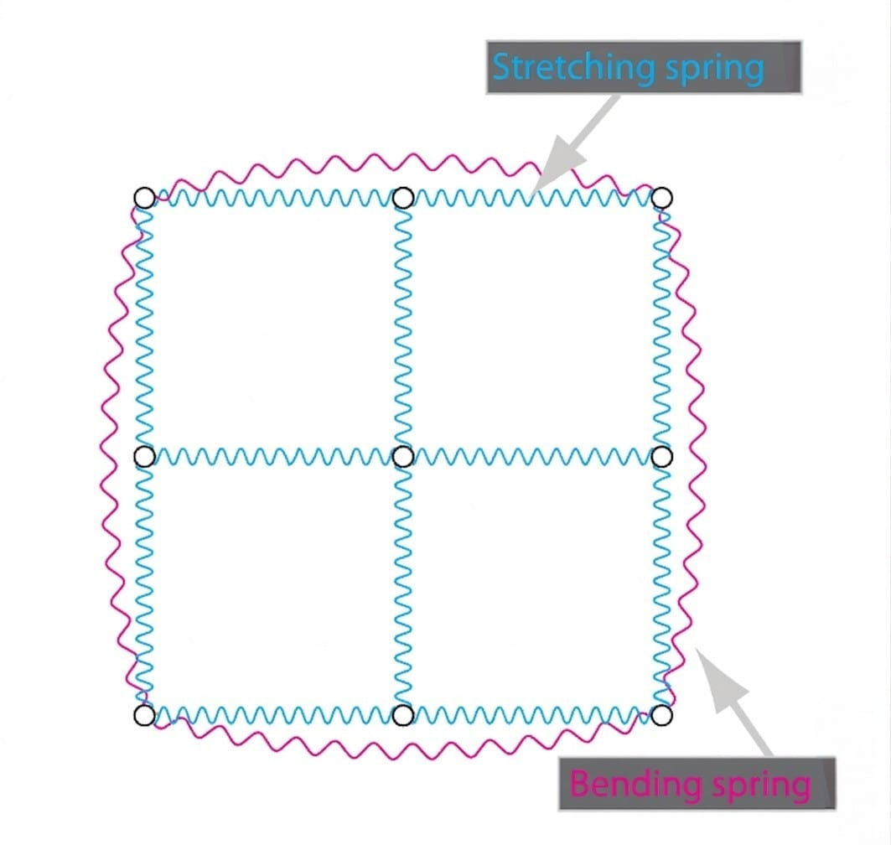
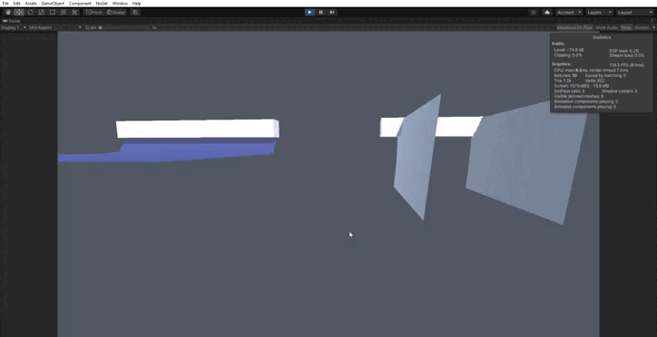

# Simulación de Tela (Mass-Spring System)

En este proyecto he desarrollado una simulación de tela en Unity basada en un modelo físico de tipo **masa-muelle**. Este enfoque consiste en discretizar una superficie en un conjunto de partículas (nodos) conectadas mediante muelles, permitiendo aproximar el comportamiento de materiales deformables como telas. A diferencia de sistemas rígidos, una tela presenta múltiples grados de libertad y responde de forma compleja a fuerzas externas, lo que requiere un modelo dinámico capaz de capturar tanto elasticidad como disipación de energía.



## Modelo físico

La tela se modela como un sistema dinámico definido por:

- Un conjunto de nodos con masa
- Un conjunto de muelles que conectan dichos nodos
- Fuerzas que actúan sobre el sistema (internas y externas)

Cada nodo ( i ) sigue la ecuación de movimiento:

$m_i \ddot{x}_i = f_i$

donde:

- ( $m_i$ ) es la masa del nodo
- ( $x_i$ ) su posición
- ( $f_i$ ) la suma de fuerzas aplicadas

## Discretización de la malla

Para construir el sistema masa-muelle, se parte de una malla triangular (por ejemplo, un plano en Unity). A partir de ella:

- Cada vértice se convierte en un nodo del sistema
- Cada arista se convierte en un muelle estructural
- Se identifican relaciones adicionales para modelar la flexión

Esto permite transformar una representación gráfica en un modelo físico simulable.

## Tipos de muelles

Para capturar correctamente el comportamiento de una tela, se utilizan distintos tipos de muelles:

### 1. Muelles de tracción (Stretch)

Conectan directamente los nodos adyacentes en la malla. Son responsables de mantener la estructura básica de la tela.

- Controlan la **resistencia a estirarse**
- Son los más importantes para la estabilidad global

### 2. Muelles de flexión (Bend)

Se crean entre nodos que no están directamente conectados, pero comparten una arista a través de dos triángulos.

- Modelan la **resistencia a doblarse**
- Permiten que la tela no se pliegue de forma irreal

Para identificarlos, se analiza la topología de la malla:

- Si una arista es compartida por dos triángulos
- Se conectan los vértices opuestos a dicha arista



## Fuerzas en el sistema

Una vez definida la estructura de nodos y muelles, el siguiente paso es modelar las fuerzas que determinan su comportamiento dinámico.

En un sistema de tela, estas fuerzas se dividen en:

- **Fuerzas externas** → como la gravedad
- **Fuerzas internas** → debidas a los muelles
- **Fuerzas de amortiguamiento** → que disipan energía

La suma de todas ellas determina la aceleración de cada nodo en cada instante.

## Fuerza de gravedad

Cada nodo está sometido a la gravedad, modelada como:

$f_{gravity} = m \cdot g$

donde:

- ( $m$ ) es la masa del nodo
- ( $g$ ) es el vector de gravedad

Esta fuerza es constante y actúa en dirección vertical, siendo la responsable de que la tela caiga y se deforme.

## Fuerza elástica (Ley de Hooke)

Los muelles modelan la resistencia del material a deformarse mediante la **ley de Hooke**:

$f_{elastic} = -k (l - l_0) \cdot \hat{d}$

donde:

- ( $k$ ) es la rigidez del muelle
- ( $l$ ) es la longitud actual
- ( $l_0$ ) es la longitud en reposo
- ( $\hat{d}$ ) es la dirección normalizada entre los nodos

Esta fuerza intenta devolver el muelle a su longitud original y actúa en direcciones opuestas sobre los dos nodos conectados

## Amortiguamiento (Damping)

En sistemas reales, la energía no se conserva indefinidamente. Para evitar oscilaciones infinitas y comportamientos inestables, se introduce amortiguamiento.

En esta simulación se emplea un modelo basado en **Rayleigh damping**, que combina:

- Amortiguamiento en los nodos
- Amortiguamiento en los muelles

### Damping en nodos

Cada nodo experimenta una fuerza proporcional a su velocidad:

$f_{damp,node} = -c \cdot v$

donde:

- ( $c$ ) es el coeficiente de damping
- ( $v$ ) es la velocidad del nodo

Esta fuerza reduce progresivamente la velocidad y simula fricción interna o resistencia del medio.

### Damping en muelles

Además, los muelles disipan energía en función del movimiento relativo de los nodos:

$f_{damp,spring} = -c \cdot ((v_A - v_B) \cdot \hat{d}) \cdot \hat{d}$

donde:

- ( $v_A, v_B$ ) son las velocidades de los nodos
- ( $\hat{d}$ ) es la dirección del muelle

Este término oolo afecta a la componente de la velocidad en la dirección del muelle, y es clave para estabilizar vibraciones en la tela.

## Importancia del equilibrio de fuerzas

El comportamiento del sistema depende fuertemente del equilibrio entre la rigidez $( k )$,  la masa $(( m ))$ y el amortiguamiento $(( c ))$.

Un mal ajuste puede provocar:

- Oscilaciones excesivas → falta de damping
- Movimiento irreal → damping demasiado alto
- Inestabilidad numérica → combinación incorrecta con el integrador

Durante el desarrollo, fue necesario ajustar cuidadosamente estos parámetros, especialmente tras introducir el damping físico real, ya que el sistema se volvió mucho más sensible.

## Integración numérica

Una vez definidas las fuerzas del sistema, el siguiente paso es integrar las ecuaciones de movimiento para actualizar posiciones y velocidades en el tiempo.

Dado que se trata de un sistema continuo, es necesario discretizar el tiempo utilizando un paso ( $\Delta t$ ). La forma en la que se realiza esta discretización tiene un impacto directo en la estabilidad de la simulación, la precisión y el coste computacional.

En esta implementación se han utilizado tres métodos de integración: explícito, simpléctico e implícito.

## Integración explícita (Euler explícito)

Es el método más sencillo:

$x_{t+1} = x_t + \Delta t \cdot v_t$

$v_{t+1} = v_t + \Delta t \cdot M^{-1} f_t$

Características:

- Muy fácil de implementar
- Computacionalmente barato
- Altamente inestable para sistemas rígidos

En simulaciones de tela, este método suele explotar rápidamente si la rigidez es alta o el paso de tiempo es grande.

## Integración simpléctica (Semi-implícita)

Una ligera modificación del método explícito mejora notablemente la estabilidad:

$v_{t+1} = v_t + \Delta t \cdot M^{-1} f_t$

$x_{t+1} = x_t + \Delta t \cdot v_{t+1}$

La diferencia clave es que la posición se actualiza usando la velocidad nueva.

Ventajas:

- Más estable que el método explícito
- Conserva mejor la energía del sistema
- Sigue siendo eficiente

Este método ofrece un buen equilibrio entre rendimiento y estabilidad, siendo adecuado para simulaciones en tiempo real.

## Integración implícita

Para sistemas más rígidos (como telas con alta rigidez), se emplea integración implícita, que requiere resolver un sistema lineal en cada paso:

$A \cdot v_{t+1} = b$

donde:

$A = M - (\Delta t \cdot \frac{\partial f}{\partial v} + \Delta t^2 \cdot \frac{\partial f}{\partial x})$

$b = (M - \Delta t \cdot \frac{\partial f}{\partial v}) \cdot v_t + \Delta t \cdot f_t$

Aquí aparecen los **jacobianos de fuerza**:

- ( $\frac{\partial f}{\partial x}$ ) → matriz de rigidez
- ( $\frac{\partial f}{\partial v}$ ) → matriz de damping

Ventajas:

- Tiene en cuenta cómo cambian las fuerzas con la posición y la velocidad
- Anticipa el comportamiento futuro del sistema
- Permite usar pasos de tiempo más grandes sin inestabilidad

El principal inconveniente es que requiere construir matrices grandes y resolver un sistema lineal en cada frame. Esto lo hace más costoso que los métodos explícitos, pero mucho más estable.

## Comparativa de métodos

| Método | Estabilidad | Coste | Uso recomendado |
| --- | --- | --- | --- |
| Explícito | Baja | Bajo | Pruebas simples |
| Simpléctico | Media | Bajo | Tiempo real |
| Implícito | Alta | Alto | Sistemas rígidos |

## Comparación de parámetros de la tela

Para demostrar cómo cambian el comportamiento físico de la tela, se hicieron varias simulaciones variando parámetros clave. Cada GIF muestra la misma tela con distintos valores. Se ha utilizado el método simplético.

### Variando la masa de la tela:

- Masa baja → la tela cae lentamente, pliegues ligeros y movimientos rápidos.
    
    
    
- Masa alta → la tela cae más rápido, los pliegues se forman lentamente y la tela es más pesada.
    
    
    

### Variando la rigidez de tracción

- Baja → la tela se estira mucho y los pliegues son pronunciados.
    
    
    
- Alta → tela más rígida, movimientos limitados y pliegues menos pronunciados.
    
    
    

### Variando la rigidez de flexión

- Baja → la tela se dobla con facilidad, movimientos suaves y fluidos.
    
    
    
- Alta → pliegues rígidos, tela más plana y estable.
    
    
    

## Integración con Unity: visualización y transformaciones

En Unity, la simulación física ocurre en coordenadas globales, mientras que los **Meshes** trabajan en coordenadas locales. Por eso, actualizar la posición de los vértices requiere transformar entre ambos espacios.

### Ciclo de actualización

La actualización se realiza en dos pasos principales:

1. **FixedUpdate()** → Simulación física
    - Se ejecuta en pasos de tiempo fijos (TimeStep)
    - Llama al método de integración seleccionado (Explícito, Simpléctico o Implícito)
    - Calcula nuevas posiciones y velocidades de los nodos
2. **Update()** → Actualización visual
    - Transforma los nodos desde coordenadas globales a locales del Mesh
    - Asigna los vértices del Mesh con las posiciones actualizadas

Código clave de MassSpring:

```
Transform trans = this.GetComponent<Transform>();
Mesh mesh = this.GetComponent<MeshFilter>().mesh;
Vector3[] vertex = new Vector3[Nodes.Count];

for (int i = 0; i < Nodes.Count; ++i)
{
    vertex[i] = trans.InverseTransformPoint(Nodes[i].Pos);
}
mesh.vertices = vertex;
```

> Nota: `InverseTransformPoint` convierte la posición global del nodo a coordenadas locales del mesh.
> 

### Fixers: nodos anclados

Algunos nodos no deben moverse (por ejemplo, los extremos de la tela colgante). Para ello, se usan objetos **Fixer**, que funcionan como colisionadores:

- Durante la inicialización, cada nodo se comprueba si está dentro del Fixer
- Si es así, se marca como **Fixed** → no se mueve ni contribuye al sistema de fuerzas

Esto asegura que la tela quede colgada o sujeta en los puntos deseados.

```
for (int f = 0; f < fixers.Count; ++f)
{
    for (int n = 0; n < Nodes.Count; ++n)
    {
        if (fixers[f].IsInside(Nodes[n].Pos))
            Nodes[n].Fixed = true;
    }
}
```

### Conexión física → visual

El ciclo completo es:

1. PhysicsManager.FixedUpdate()
    - Llama a `stepSymplectic()` o al integrador elegido
    - Calcula nuevas posiciones y velocidades de todos los nodos
2. MassSpring.SetPosition()
    - Actualiza internamente el estado de nodos y muelles
3. MassSpring.FixedUpdate()
    - Transforma nodos a coordenadas locales
    - Actualiza el Mesh de Unity

Esto garantiza que la simulación física y la visualización estén perfectamente sincronizadas.

### Construcción eficiente de la estructura

Uno de los aspectos clave en la implementación es la generación de muelles sin duplicados.

Inicialmente, una implementación directa puede recorrer todas las aristas comparándolas entre sí, lo que resulta en un coste: $( O(n^2) )$ (ineficiente para mallas grandes)

Para evitarlo, se utiliza un diccionario de aristas: Cada arista se representa como una pareja ordenada de índices: $(min(i, j), max(i, j))$

Si una arista aparece por primera vez, se crea un muelle de tipo **stretch y s**e almacena en el diccionario. Si aparece de nuevo, se crea un muelle de tipo **bend** entre los vértices opuestos

Este enfoque reduce la complejidad a ( O(n) ) ( mucho más eficiente) y evita duplicar muelles, lo cual es fundamental para mantener un comportamiento físico correcto.

```
Dictionary<(int,int), Edge> edgeMap = new Dictionary<(int,int), Edge>();

foreach (Edge e in Edges)
{
    var key = (Math.Min(e.a,e.b), Math.Max(e.a,e.b));
    if(edgeMap.ContainsKey(key))
        Springs.Add(new Spring(Nodes[e.c], Nodes[edgeMap[key].c], SpringType.Bend));
    else
        edgeMap[key] = e;
}
```
